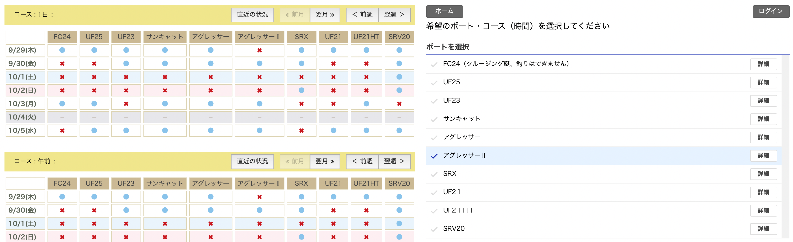
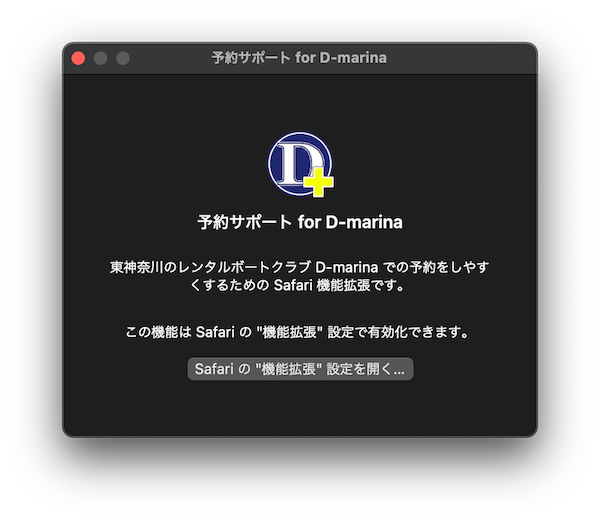

# 予約サポート for D-marina.

 

東神奈川のレンタルボートクラブ <a href="http://www.daruma-marine.com">D-marina</a> での予約をしやすくするための Safari 機能拡張です。

これを使うと、D-marina の <a href="https://d-marina.resv.jp/reserve/calendar.php?x=1522390798">予約ページ</a> で全てのレンタルボートにおける空き状況を確認できるので、たとえば友人を誘い合わせてレンタルボートを借りたいときに、日程を優先してその日に空いているボートを選ぶみたいな借り方がしやすくなります。

 

> このツールは D-marina 非公式です。予約システムが仕様変更されたときには動作しなくなる場合があります。その際は公式の手順に従って予約を行ってください。

## インストール方法

アプリ `D-marina-EasyToReserve.app` を、[アプリケーションフォルダー](/Applications) にコピーしたら、そのアプリをダブルクリックして実行します。

アプリが起動したら `Safari の "機能拡張" 設定を開く...` をクリックして、機能拡張のリストから `予約サポート for D-marina` にチェックを入れて有効化します。

## 使用方法

Safari で D-marina の [予約ページ](https://d-marina.resv.jp/reserve/calendar.php?x=1522390798) を開きます。

ツールバーにある  をクリックすると、選択している予約日時におけるすべての船の空き状況がコースごとに表示されます。

空き状況が表示されたら、空いている日程のところに表示される `●` 印をクリックすると、その `ボート` と `コース` の情報が、公式の予約ページに適用されるので、あとは正式な手順で予約を進めていきます。

## 更新情報

### v1.1.1

- 表示中の Safari ウィンドウが小さいときにレイアウトが崩れることがある問題を修正しました。

### v1.1.0

- この機能拡張で挿入された空き状況の一覧からもカレンダーを操作できるようになりました。
- ローカライズが適切に行われていない箇所を修正しました。
- [App Store](https://apps.apple.com/jp/app/%E4%BA%88%E7%B4%84%E3%82%B5%E3%83%9D%E3%83%BC%E3%83%88-for-d-marina/id1586571019?mt=12) にて提供を開始しました。

### v1.0.0

- 東神奈川にあるレンタルボートクラブ [D-marina](http://www.daruma-marine.com) の [予約ページ](https://d-marina.resv.jp/reserve/calendar.php?x=1522390798) で、ボートの空き状況を日付を起点に探しやすくする機能を搭載しました。
- [GitHub](https://github.com/es-kumagai/D-marina-EasyToReserve) にて提供を開始しました。
